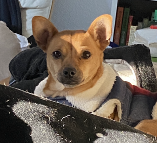

# About Me
Navigation:

1. [Intro](#Introduction)

2. [Academics](#Academics)

3. [Personal](#Personal)
## Introduction
Hi, my name is Timothy (Tim) Chu(he/him/his). I'm a second-year **Math-CS** student. My ~~relatively empty~~ github is located here: [link](https://github.com/tea-mochi)


## Academics
I am a second year math-cs major, and with my remaining time in school I hope to widen my perspective in topics relating to math and CS.
The most enjoyable classes I've taken so far are CSE101, MATH184, MATH31A.
I am a simple person: my favorite command is `make`, and my favorite C++ operator is `<<` bit shift `>>`.

Goals:

- [x] Get enough sleep 🛌
- [ ] Complete spring quarter ✍
- [ ] Rule the world 🧍‍♂️

## Personal
Some things I enjoy include:
* exploring new foods
* playing video games
* playing with dogs
* listening to music
* singing in the shower

>"Where are dog photos?"



also friend's dog [here](pics/dog1.png) [here](pics/dog2.png) [here](pics/dog3.png)

Thank you for visiting

```return;```